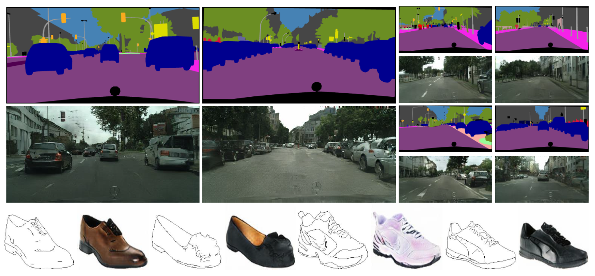

# Lab2Pix-V1
Lab2Pix: Label-Adaptive Generative Adversarial Network for Unsupervised Image Synthesis



Lab2Pix: Label-Adaptive Generative Adversarial Network for Unsupervised Image Synthesis.
In ACM MM 2020. [paper](https://dl.acm.org/doi/abs/10.1145/3394171.3414027)

## Installztion
Clone this repo.

```bash
git clone https://github.com/RoseRollZhu/Lab2Pix-V1.git
cd Lab2Pix-V1/
```

This code requires PyTorch framework and CUDA environment. PyTorch 1.0.0 + and python 3.7.0 + with Anaconda environment are recommonded. Please install dependencies by

```bash
pip install -r requirements.txt
```

## Dataset
All the datasets used in this research must be downloaded beforehand.

**Cityscapes Dataset** can be downloaded [here](https://www.cityscapes-dataset.com/). In particular, you will need to download leftImg8bit_trainvaltest.zip, gtFine_trainvaltest.zip. The images and labels should be arranged as below:

```
Lab2Pix
|───datasets
|   |───cityscapes
|   |   |───leftImg8bit
|   |   |   |───train
|   |   |   |   |───aachen
|   |   |   |   |   |───aachen_000000_000019_leftImg8bit.png
|   |   |   |───val
|   |   |   |   |───frankfurt
|   |   |   |   |   |───frankfurt_000000_000294_leftImg8bit.png
|   |   |───gtFine
|   |   |   |───train
|   |   |   |   |───aachen
|   |   |   |   |   |───aachen_000000_000019_gtFine_color.png
|   |   |   |   |   |───aachen_000000_000019_gtFine_labelIds.png
|   |   |   |───val
|   |   |   |   |───frankfurt
|   |   |   |   |   |───frankfurt_000000_000294_gtFine_color.png
|   |   |   |   |   |───frankfurt_000000_000294_gtFine_labelIds.png
```

**edges2shoes Dataset** can be downloaded following the [website](https://github.com/phillipi/pix2pix). The images and labels should be arranged as below:

```
Lab2Pix
|───datasets
|   |───facades
|   |   |───train
|   |   |   |───1_AB.jpg
|   |   |───val
|   |   |   |───1_AB.jpg
```
**edges2handbags Dataset** can be downloaded following the [website](https://github.com/phillipi/pix2pix). The file structure should be arranged as the same as edges2shoes Dataset.

## Train Models
Before you train new models, make sure you have prepared the datasets in proper structure. If you place dataset in other direction, you can use ```--dataroot [path to dataset]``` to specify the correct direction. Note that, the dataset root filename like 'cityscapes' can not be renamed. You can also change the save path of the checkpoints by specifying ```--checkpoints_dir [path to checkpoints]```. The model will automatically continue training when the checkpoint is saved in the target direction.

Then you can train your model
```bash
# To train on cityscapes or edges2shoes dataset, for example
python train.py --name label2cityscapes --dataroot ./datasets/cityscapes --batchSize 1
python train.py --name label2shoes --dataroot ./datasets/edges2shoes --batchSize 4
```

If you have GPUs more than one, you can use ```--gpu_ids [GPU ids split with ","]``` to specify multi GPUs working (e.g. ```--gpu_ids 0,1,2,3```) and you can increase the batch size ```--batchSize [batch size number]```.

## Test Models
If you have trained a model or you can choose to download a pretrained one for [cityscapes](https://drive.google.com/file/d/1wd5BLHHwIeKs3jUotFEclfgUpxnyVHKi/view?usp=sharing), [edges2shoes](https://drive.google.com/file/d/1POinOyYIP330RUWhs79emaUaRF_606oW/view?usp=sharing), [edges2handbags](https://drive.google.com/file/d/1JSmrdzu6sH3ZmzX8VT6gwSKabTLozeFy/view?usp=sharing), you can test it with the following commond
```bash
# To test on cityscapes, for example
python test.py --name Lab2PixV1_pretrained_cityscapes --dataroot ./datasets/cityscapes  --results_dir ./results/cityscapes
```

If you don't want to test all samples in datasets, you can specify ```--max_test_num [the max number of the test]```. By default, the progress loads the latest checkpoint. It can be changed using ```--which_epoch [epoch number]```.

## Citation
If you use this code or find this work helpful for your research, please cite our papers.
```
@inproceedings{GaoZSZS20,
  author    = {Lianli Gao and
               Junchen Zhu and
               Jingkuan Song and
               Feng Zheng and
               Heng Tao Shen},
  title     = {Lab2Pix: Label-Adaptive Generative Adversarial Network for Unsupervised
               Image Synthesis},
  booktitle = {{MM} '20: The 28th {ACM} International Conference on Multimedia, Virtual
               Event / Seattle, WA, USA, October 12-16, 2020},
  pages     = {3734--3742},
  year      = {2020}
}
```


